# 校园通勤班车智能排班系统 - UML图（Mermaid）

## 1. 系统架构图

```mermaid
graph TB
    subgraph 用户层
        direction LR
        A[师生用户]
        B[调度管理员]
        C[系统管理员]
    end

    subgraph 前端展示层["前端展示层 (Vue 3 + Element Plus + ECharts)"]
        direction LR
        E[师生门户<br/>PassengerView]
        F[运行概览<br/>DashboardView]
        G[班次管理<br/>ScheduleView]
        H[调度事件<br/>DispatchView]
        I[基础资源<br/>ResourceView]
        J[统计分析<br/>AnalyticsView]
    end

    subgraph 前端工程层["前端工程支撑 (Vite)"]
        direction LR
        K1[Vue Router<br/>角色路由守卫]
        K2[Pinia Store<br/>认证状态]
        K3[Axios<br/>Token注入/拦截]
    end

    subgraph 服务端["服务端 (Node.js + Express)"]
        direction LR
        L[JWT认证中间件]
        M[角色权限中间件]
    end

    subgraph 业务逻辑层["业务服务层"]
        direction LR
        N[认证服务]
        O[排班服务]
        P[调度服务]
        Q[门户服务]
        R[仪表盘服务]
    end

    subgraph 算法层["智能排班引擎 (GA+PSO)"]
        direction LR
        S[遗传算法GA<br/>种群20/迭代30代]
        T[粒子群PSO<br/>5粒子/迭代10次]
        U[适应度函数<br/>四目标加权]
    end

    subgraph 数据层["数据持久层 (MySQL)"]
        direction LR
        DB[(campus_shuttle<br/>路线/班次/车辆/客流/用户)]
    end

    用户层 --> 前端展示层
    前端展示层 --- 前端工程层
    前端工程层 -->|HTTP/JSON| 服务端
    服务端 --> 业务逻辑层
    业务逻辑层 --> 算法层
    业务逻辑层 <--> 数据层
    算法层 --> 数据层
```

## 2. 用例图

### 2.1 师生用例图

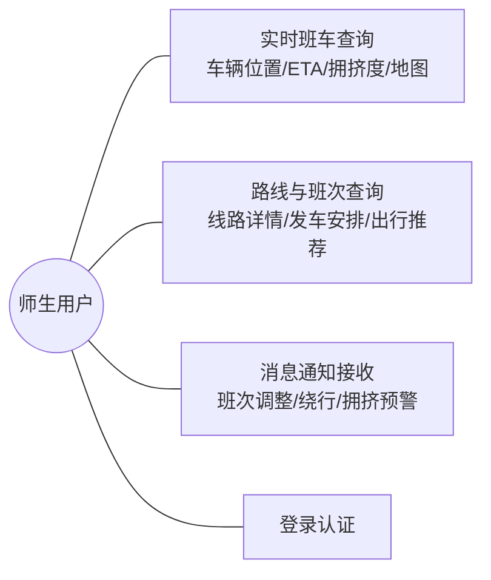
```mermaid
graph LR
    Student((师生用户))

    Student --- UC1[实时班车查询<br>车辆位置/ETA/拥挤度/地图]
    Student --- UC2[路线与班次查询<br>线路详情/发车安排/出行推荐]
    Student --- UC3[消息通知接收<br>班次调整/绕行/拥挤预警]
    Student --- UC4[登录认证]
```

### 2.2 调度管理员用例图

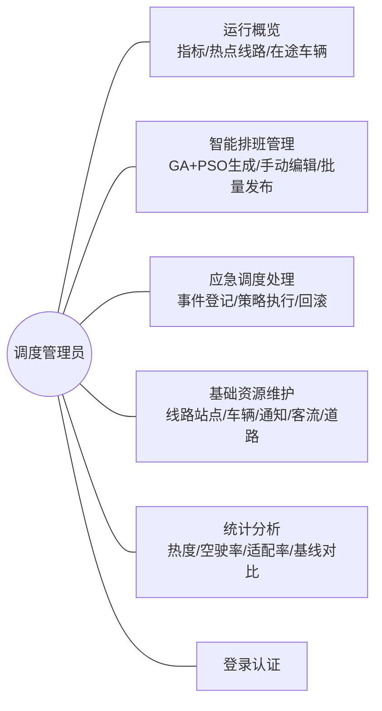
```mermaid
graph LR
    Dispatcher((调度管理员))

    Dispatcher --- UC1[运行概览<br>指标/热点线路/在途车辆]
    Dispatcher --- UC2[智能排班管理<br>GA+PSO生成/手动编辑/批量发布]
    Dispatcher --- UC3[应急调度处理<br>事件登记/策略执行/回滚]
    Dispatcher --- UC4[基础资源维护<br>线路站点/车辆/通知/客流/道路]
    Dispatcher --- UC5[统计分析<br>热度/空驶率/适配率/基线对比]
    Dispatcher --- UC6[登录认证]
```

### 2.3 系统管理员用例图

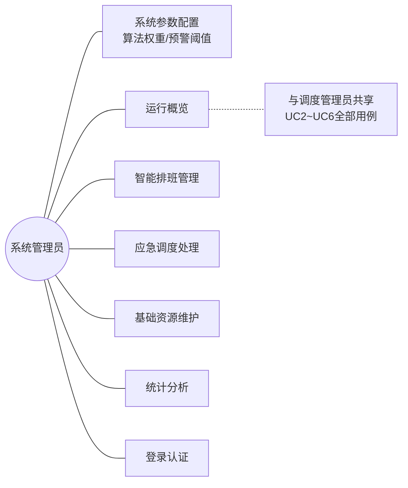
```mermaid
graph LR
    Admin((系统管理员))

    Admin --- UC1[系统参数配置<br>算法权重/预警阈值]
    Admin --- UC2[运行概览]
    Admin --- UC3[智能排班管理]
    Admin --- UC4[应急调度处理]
    Admin --- UC5[基础资源维护]
    Admin --- UC6[统计分析]
    Admin --- UC7[登录认证]

    UC2 -.- NOTE[与调度管理员共享<br>UC2~UC6全部用例]
```

## 3. 系统架构图（技术分层视角）

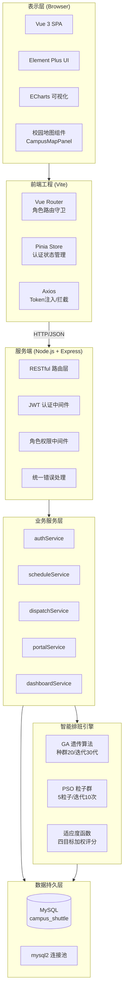
```mermaid
graph TD
    subgraph 表示层["表示层 (Browser)"]
        direction LR
        V1[Vue 3 SPA]
        V2[Element Plus UI]
        V3[ECharts 可视化]
        V4[校园地图组件<br>CampusMapPanel]
    end

    subgraph 前端工程["前端工程 (Vite)"]
        direction LR
        R1[Vue Router<br>角色路由守卫]
        R2[Pinia Store<br>认证状态管理]
        R3[Axios<br>Token注入/拦截]
    end

    subgraph 服务端["服务端 (Node.js + Express)"]
        direction LR
        S1[RESTful 路由层]
        S2[JWT 认证中间件]
        S3[角色权限中间件]
        S4[统一错误处理]
    end

    subgraph 业务层["业务服务层"]
        direction LR
        B1[authService]
        B2[scheduleService]
        B3[dispatchService]
        B4[portalService]
        B5[dashboardService]
    end

    subgraph 算法引擎["智能排班引擎"]
        direction LR
        A1[GA 遗传算法<br>种群20/迭代30代]
        A2[PSO 粒子群<br>5粒子/迭代10次]
        A3[适应度函数<br>四目标加权评分]
    end

    subgraph 数据层["数据持久层"]
        direction LR
        D1[(MySQL<br>campus_shuttle)]
        D2[mysql2 连接池]
    end

    表示层 --> 前端工程
    前端工程 -->|HTTP/JSON| 服务端
    服务端 --> 业务层
    业务层 --> 算法引擎
    业务层 --> 数据层
    算法引擎 --> 数据层
```

## 4. 各功能模块流程图

### 4.1 用户登录流程

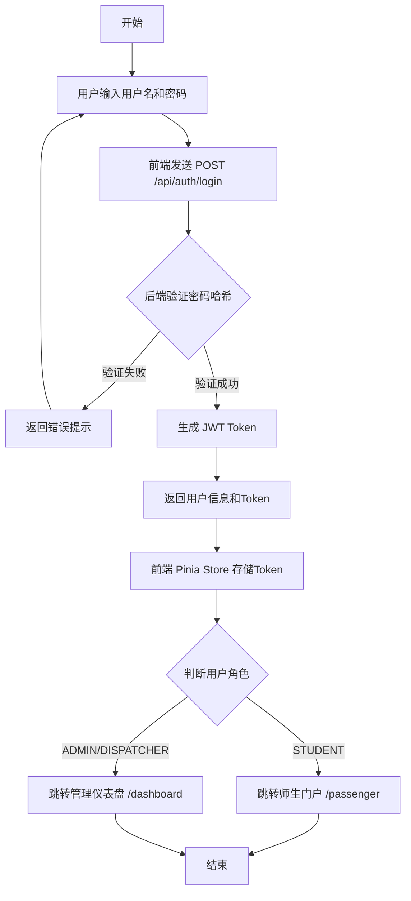
```mermaid
flowchart TD
    A[开始] --> B[用户输入用户名和密码]
    B --> C[前端发送 POST /api/auth/login]
    C --> D{后端验证密码哈希}
    D -->|验证失败| E[返回错误提示]
    E --> B
    D -->|验证成功| F[生成 JWT Token]
    F --> G[返回用户信息和Token]
    G --> H[前端 Pinia Store 存储Token]
    H --> I{判断用户角色}
    I -->|STUDENT| J[跳转师生门户 /passenger]
    I -->|ADMIN/DISPATCHER| K[跳转管理仪表盘 /dashboard]
    J --> L[结束]
    K --> L
```

### 4.2 智能排班生成流程

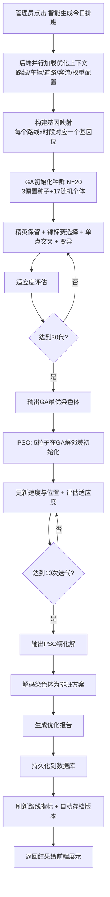
```mermaid
flowchart TD
    A[管理员点击 智能生成今日排班] --> B[后端并行加载优化上下文<br>路线/车辆/道路/客流/权重配置]
    B --> H[构建基因映射<br>每个路线x时段对应一个基因位]
    H --> I[GA初始化种群 N=20<br>3偏置种子+17随机个体]
    I --> J[精英保留 + 锦标赛选择 + 单点交叉 + 变异]
    J --> K[适应度评估]
    K --> O{达到30代?}
    O -->|否| J
    O -->|是| P[输出GA最优染色体]
    P --> Q[PSO: 5粒子在GA解邻域初始化]
    Q --> R[更新速度与位置 + 评估适应度]
    R --> T{达到10次迭代?}
    T -->|否| R
    T -->|是| U[输出PSO精化解]
    U --> V[解码染色体为排班方案]
    V --> W[生成优化报告]
    W --> X[持久化到数据库]
    X --> Y[刷新路线指标 + 自动存档版本]
    Y --> AA[返回结果给前端展示]
```

### 4.3 应急调度流程

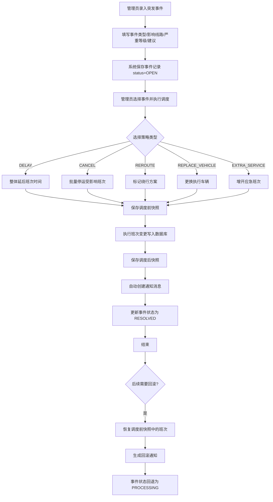
```mermaid
flowchart TD
    A[管理员录入突发事件] --> B[填写事件类型/影响线路/严重等级/建议]
    B --> C[系统保存事件记录 status=OPEN]
    C --> D[管理员选择事件并执行调度]

    D --> E{选择策略类型}
    E -->|DELAY| F[整体延后班次时间]
    E -->|CANCEL| G[批量停运受影响班次]
    E -->|REROUTE| H[标记绕行方案]
    E -->|REPLACE_VEHICLE| I[更换执行车辆]
    E -->|EXTRA_SERVICE| J[增开应急班次]

    F --> K[保存调度前快照]
    G --> K
    H --> K
    I --> K
    J --> K
    K --> L[执行班次变更写入数据库]
    L --> M[保存调度后快照]
    M --> N[自动创建通知消息]
    N --> O[更新事件状态为 RESOLVED]
    O --> P[结束]

    P --> Q{后续需要回滚?}
    Q -->|是| R[恢复调度前快照中的班次]
    R --> S[生成回滚通知]
    S --> T[事件状态回退为 PROCESSING]
```

### 4.4 师生实时查询流程

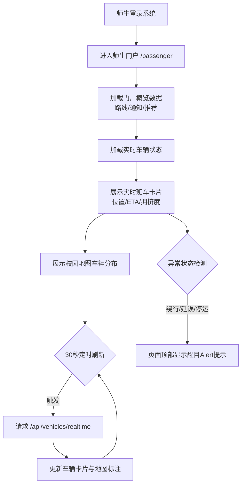
```mermaid
flowchart TD
    A[师生登录系统] --> B[进入师生门户 /passenger]
    B --> C[加载门户概览数据<br>路线/通知/推荐]
    C --> D[加载实时车辆状态]
    D --> E[展示实时班车卡片<br>位置/ETA/拥挤度]
    E --> F[展示校园地图车辆分布]

    F --> G{30秒定时刷新}
    G -->|触发| H[请求 /api/vehicles/realtime]
    H --> I[更新车辆卡片与地图标注]
    I --> G

    E --> J{异常状态检测}
    J -->|绕行/延误/停运| K[页面顶部显示醒目Alert提示]
```

### 4.5 班次发布与版本管理流程

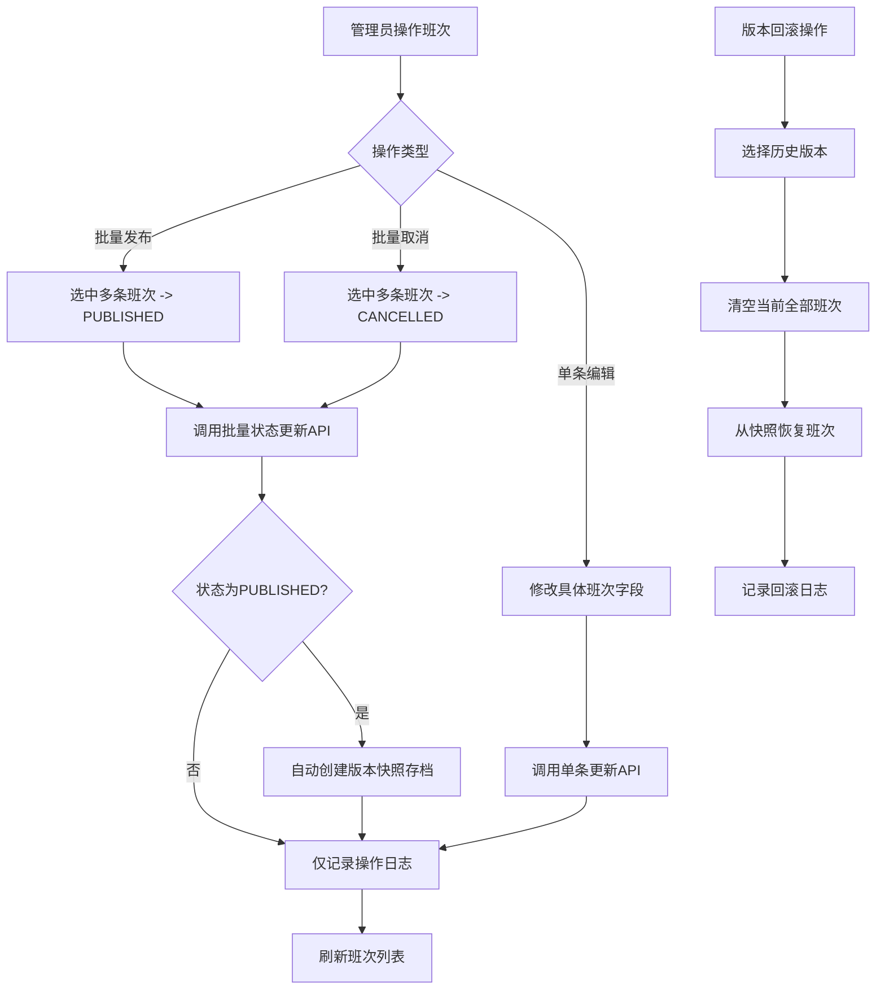
```mermaid
flowchart TD
    A[管理员操作班次] --> B{操作类型}
    B -->|批量发布| C[选中多条班次 -> PUBLISHED]
    B -->|批量取消| D[选中多条班次 -> CANCELLED]
    B -->|单条编辑| E[修改具体班次字段]

    C --> F[调用批量状态更新API]
    D --> F
    E --> G[调用单条更新API]

    F --> H{状态为PUBLISHED?}
    H -->|是| I[自动创建版本快照存档]
    H -->|否| J[仅记录操作日志]
    I --> J

    G --> J
    J --> K[刷新班次列表]

    L[版本回滚操作] --> M[选择历史版本]
    M --> N[清空当前全部班次]
    N --> O[从快照恢复班次]
    O --> P[记录回滚日志]
```

## 5. GA+PSO 混合优化算法流程图

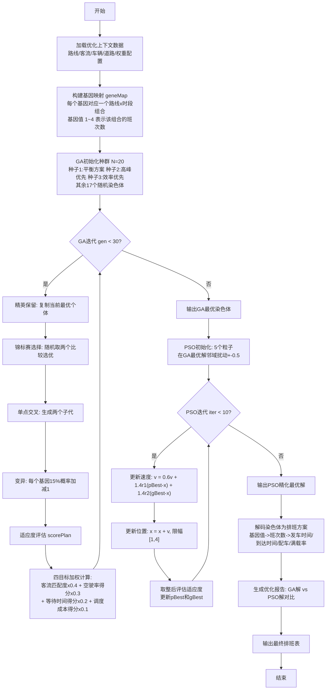
```mermaid
flowchart TD
    START[开始] --> INPUT[加载优化上下文数据<br>路线/客流/车辆/道路/权重配置]
    INPUT --> ENCODE[构建基因映射 geneMap<br>每个基因对应一个路线x时段组合<br>基因值 1~4 表示该组合的班次数]
    ENCODE --> GA_INIT[GA初始化种群 N=20<br>种子1:平衡方案 种子2:高峰优先 种子3:效率优先<br>其余17个随机染色体]
    GA_INIT --> GA_LOOP{GA迭代 gen < 30?}
    GA_LOOP -->|是| ELITE[精英保留: 复制当前最优个体]
    ELITE --> SELECT[锦标赛选择: 随机取两个比较选优]
    SELECT --> CROSS[单点交叉: 生成两个子代]
    CROSS --> MUTATE["变异: 每个基因15%概率加减1"]
    MUTATE --> FIT_EVAL[适应度评估 scorePlan]
    FIT_EVAL --> FIT_DETAIL["四目标加权计算:<br>客流匹配度x0.4 + 空驶率得分x0.3<br>+ 等待时间得分x0.2 + 调度成本得分x0.1"]
    FIT_DETAIL --> GA_LOOP
    GA_LOOP -->|否| GA_BEST[输出GA最优染色体]

    GA_BEST --> PSO_INIT["PSO初始化: 5个粒子<br>在GA最优解邻域扰动+-0.5"]
    PSO_INIT --> PSO_LOOP{PSO迭代 iter < 10?}
    PSO_LOOP -->|是| VEL["更新速度: v = 0.6v + 1.4r1(pBest-x) + 1.4r2(gBest-x)"]
    VEL --> POS["更新位置: x = x + v, 限幅[1,4]"]
    POS --> PSO_FIT[取整后评估适应度<br>更新pBest和gBest]
    PSO_FIT --> PSO_LOOP
    PSO_LOOP -->|否| PSO_BEST[输出PSO精化最优解]

    PSO_BEST --> DECODE["解码染色体为排班方案<br>基因值->班次数->发车时间/到达时间/配车/满载率"]
    DECODE --> REPORT[生成优化报告: GA解 vs PSO解对比]
    REPORT --> OUTPUT[输出最终排班表]
    OUTPUT --> ENDING[结束]
```

## 6. 数据库 ER 图

> 采用 Chen 式 ER 图表示法：矩形=实体，椭圆(圆角框)=属性，菱形=联系，下划线=主键。
> 由于属性较多，每个实体仅展示核心属性，完整字段见数据库建表 SQL。

### 6.1 核心业务 ER 图（路线-班次-车辆）

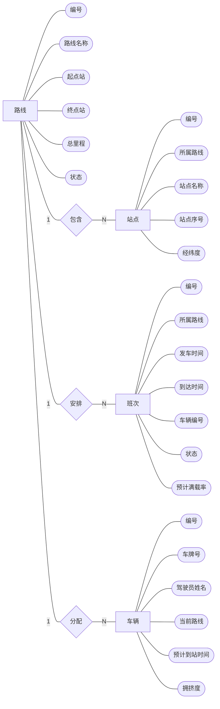
```mermaid
graph LR
    %% 实体
    E_ROUTE[路线]
    E_STOP[站点]
    E_SCHEDULE[班次]
    E_VEHICLE[车辆]

    %% 路线属性
    E_ROUTE --- A_R1([编号])
    E_ROUTE --- A_R2([路线名称])
    E_ROUTE --- A_R3([起点站])
    E_ROUTE --- A_R4([终点站])
    E_ROUTE --- A_R5([总里程])
    E_ROUTE --- A_R6([状态])

    %% 站点属性
    E_STOP --- A_S1([编号])
    E_STOP --- A_S2([所属路线])
    E_STOP --- A_S3([站点名称])
    E_STOP --- A_S4([站点序号])
    E_STOP --- A_S5([经纬度])

    %% 班次属性
    E_SCHEDULE --- A_SC1([编号])
    E_SCHEDULE --- A_SC2([所属路线])
    E_SCHEDULE --- A_SC3([发车时间])
    E_SCHEDULE --- A_SC4([到达时间])
    E_SCHEDULE --- A_SC5([车辆编号])
    E_SCHEDULE --- A_SC6([状态])
    E_SCHEDULE --- A_SC7([预计满载率])

    %% 车辆属性
    E_VEHICLE --- A_V1([编号])
    E_VEHICLE --- A_V2([车牌号])
    E_VEHICLE --- A_V3([驾驶员姓名])
    E_VEHICLE --- A_V4([当前路线])
    E_VEHICLE --- A_V5([预计到站时间])
    E_VEHICLE --- A_V6([拥挤度])

    %% 联系（边上标注基数）
    E_ROUTE ---|"1"| R1{包含}
    R1 ---|"N"| E_STOP
    E_ROUTE ---|"1"| R2{安排}
    R2 ---|"N"| E_SCHEDULE
    E_ROUTE ---|"1"| R3{分配}
    R3 ---|"N"| E_VEHICLE
```

### 6.2 调度与通知 ER 图

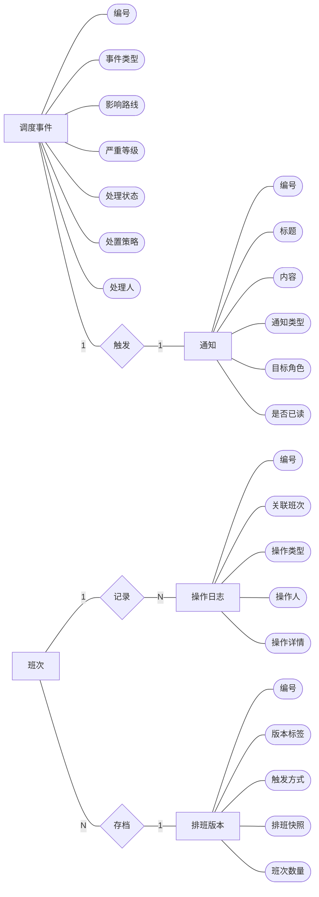
```mermaid
graph LR
    %% 实体
    E_DISPATCH[调度事件]
    E_NOTIFY[通知]
    E_LOG[操作日志]
    E_VERSION[排班版本]
    E_SCHEDULE2[班次]

    %% 调度事件属性
    E_DISPATCH --- A_DE1([编号])
    E_DISPATCH --- A_DE2([事件类型])
    E_DISPATCH --- A_DE3([影响路线])
    E_DISPATCH --- A_DE4([严重等级])
    E_DISPATCH --- A_DE5([处理状态])
    E_DISPATCH --- A_DE6([处置策略])
    E_DISPATCH --- A_DE7([处理人])

    %% 通知属性
    E_NOTIFY --- A_N1([编号])
    E_NOTIFY --- A_N2([标题])
    E_NOTIFY --- A_N3([内容])
    E_NOTIFY --- A_N4([通知类型])
    E_NOTIFY --- A_N5([目标角色])
    E_NOTIFY --- A_N6([是否已读])

    %% 操作日志属性
    E_LOG --- A_L1([编号])
    E_LOG --- A_L2([关联班次])
    E_LOG --- A_L3([操作类型])
    E_LOG --- A_L4([操作人])
    E_LOG --- A_L5([操作详情])

    %% 版本属性
    E_VERSION --- A_VR1([编号])
    E_VERSION --- A_VR2([版本标签])
    E_VERSION --- A_VR3([触发方式])
    E_VERSION --- A_VR4([排班快照])
    E_VERSION --- A_VR5([班次数量])

    %% 联系（边上标注基数）
    E_DISPATCH ---|"1"| R1{触发}
    R1 ---|"1"| E_NOTIFY
    E_SCHEDULE2 ---|"1"| R2{记录}
    R2 ---|"N"| E_LOG
    E_SCHEDULE2 ---|"N"| R3{存档}
    R3 ---|"1"| E_VERSION
```

### 6.3 用户与数据采集 ER 图

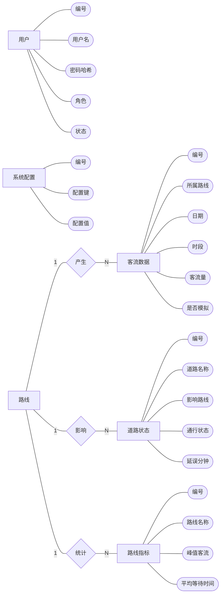
```mermaid
graph LR
    %% 实体
    E_USER[用户]
    E_FLOW[客流数据]
    E_ROAD[道路状态]
    E_CONFIG[系统配置]
    E_METRICS[路线指标]
    E_ROUTE2[路线]

    %% 用户属性
    E_USER --- A_U1([编号])
    E_USER --- A_U2([用户名])
    E_USER --- A_U3([密码哈希])
    E_USER --- A_U4([角色])
    E_USER --- A_U5([状态])

    %% 客流属性
    E_FLOW --- A_F1([编号])
    E_FLOW --- A_F2([所属路线])
    E_FLOW --- A_F3([日期])
    E_FLOW --- A_F4([时段])
    E_FLOW --- A_F5([客流量])
    E_FLOW --- A_F6([是否模拟])

    %% 道路属性
    E_ROAD --- A_RD1([编号])
    E_ROAD --- A_RD2([道路名称])
    E_ROAD --- A_RD3([影响路线])
    E_ROAD --- A_RD4([通行状态])
    E_ROAD --- A_RD5([延误分钟])

    %% 路线指标属性
    E_METRICS --- A_M1([编号])
    E_METRICS --- A_M2([路线名称])
    E_METRICS --- A_M3([峰值客流])
    E_METRICS --- A_M4([平均等待时间])

    %% 配置属性
    E_CONFIG --- A_C1([编号])
    E_CONFIG --- A_C2([配置键])
    E_CONFIG --- A_C3([配置值])

    %% 联系（边上标注基数）
    E_ROUTE2 ---|"1"| R1{产生}
    R1 ---|"N"| E_FLOW
    E_ROUTE2 ---|"1"| R2{影响}
    R2 ---|"N"| E_ROAD
    E_ROUTE2 ---|"1"| R3{统计}
    R3 ---|"N"| E_METRICS
```

## 7. 各功能时序图

### 7.1 用户登录时序图

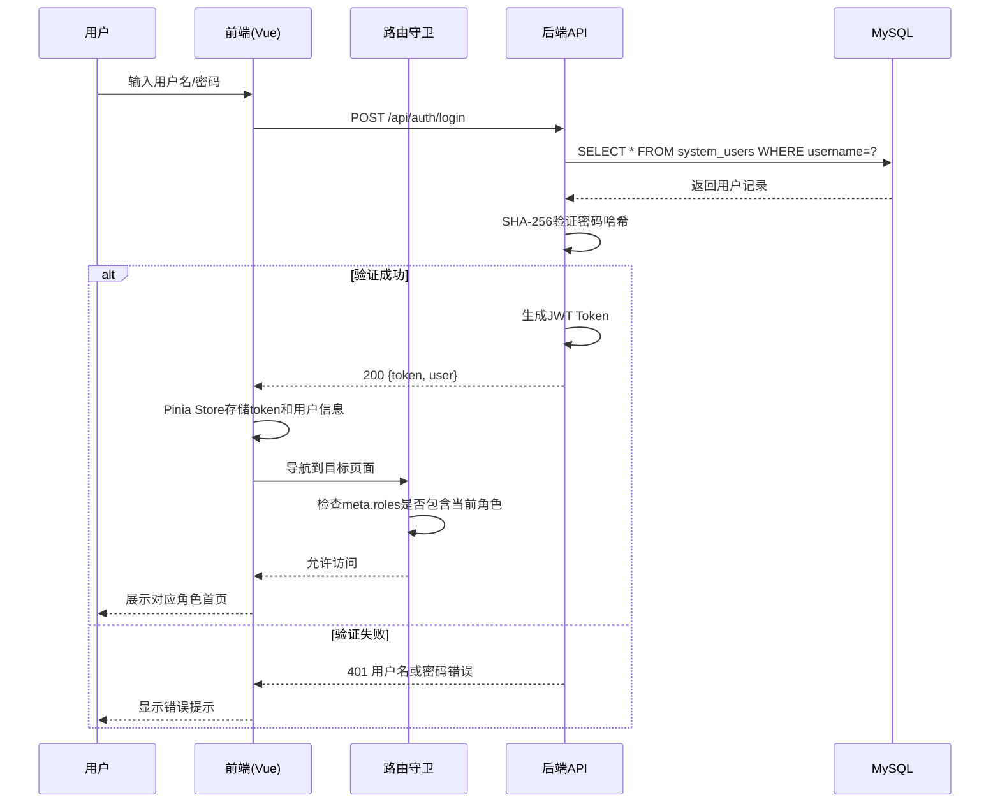
```mermaid
sequenceDiagram
    participant U as 用户
    participant F as 前端(Vue)
    participant R as 路由守卫
    participant A as 后端API
    participant DB as MySQL

    U->>F: 输入用户名/密码
    F->>A: POST /api/auth/login
    A->>DB: SELECT * FROM system_users WHERE username=?
    DB-->>A: 返回用户记录
    A->>A: SHA-256验证密码哈希
    alt 验证成功
        A->>A: 生成JWT Token
        A-->>F: 200 {token, user}
        F->>F: Pinia Store存储token和用户信息
        F->>R: 导航到目标页面
        R->>R: 检查meta.roles是否包含当前角色
        R-->>F: 允许访问
        F-->>U: 展示对应角色首页
    else 验证失败
        A-->>F: 401 用户名或密码错误
        F-->>U: 显示错误提示
    end
```

### 7.2 智能排班生成时序图

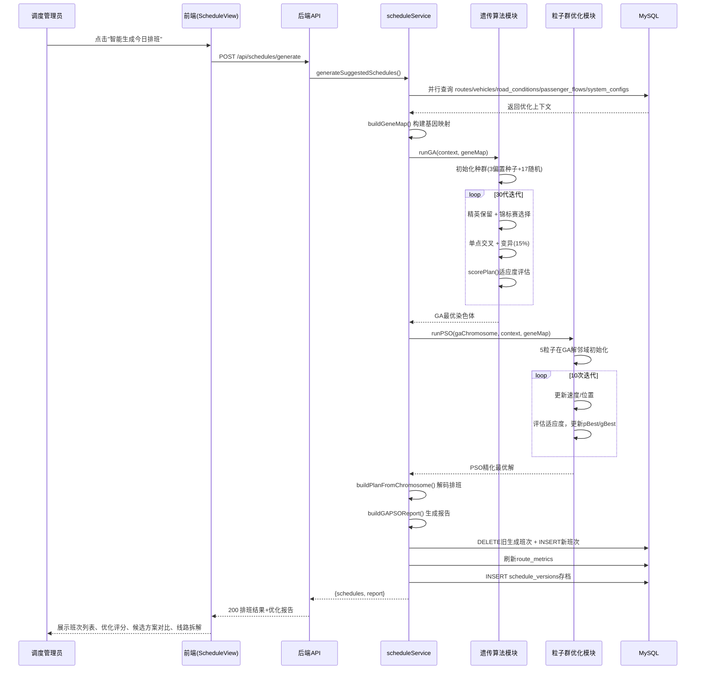
```mermaid
sequenceDiagram
    participant U as 调度管理员
    participant F as 前端(ScheduleView)
    participant A as 后端API
    participant S as scheduleService
    participant GA as 遗传算法模块
    participant PSO as 粒子群优化模块
    participant DB as MySQL

    U->>F: 点击"智能生成今日排班"
    F->>A: POST /api/schedules/generate
    A->>S: generateSuggestedSchedules()
    S->>DB: 并行查询 routes/vehicles/road_conditions/passenger_flows/system_configs
    DB-->>S: 返回优化上下文

    S->>S: buildGeneMap() 构建基因映射
    S->>GA: runGA(context, geneMap)
    GA->>GA: 初始化种群(3偏置种子+17随机)
    loop 30代迭代
        GA->>GA: 精英保留 + 锦标赛选择
        GA->>GA: 单点交叉 + 变异(15%)
        GA->>GA: scorePlan()适应度评估
    end
    GA-->>S: GA最优染色体

    S->>PSO: runPSO(gaChromosome, context, geneMap)
    PSO->>PSO: 5粒子在GA解邻域初始化
    loop 10次迭代
        PSO->>PSO: 更新速度/位置
        PSO->>PSO: 评估适应度，更新pBest/gBest
    end
    PSO-->>S: PSO精化最优解

    S->>S: buildPlanFromChromosome() 解码排班
    S->>S: buildGAPSOReport() 生成报告
    S->>DB: DELETE旧生成班次 + INSERT新班次
    S->>DB: 刷新route_metrics
    S->>DB: INSERT schedule_versions存档

    S-->>A: {schedules, report}
    A-->>F: 200 排班结果+优化报告
    F-->>U: 展示班次列表、优化评分、候选方案对比、线路拆解
```

### 7.3 应急调度执行时序图

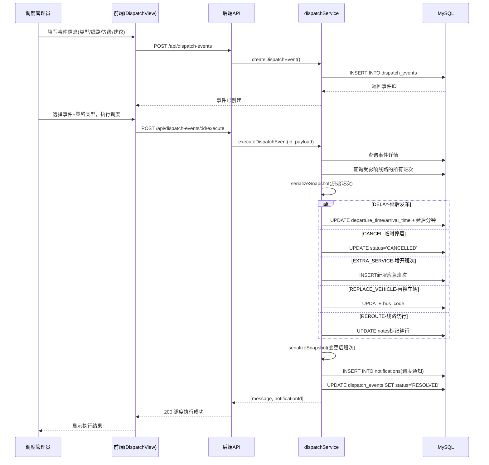
```mermaid
sequenceDiagram
    participant U as 调度管理员
    participant F as 前端(DispatchView)
    participant A as 后端API
    participant DS as dispatchService
    participant DB as MySQL

    U->>F: 填写事件信息(类型/线路/等级/建议)
    F->>A: POST /api/dispatch-events
    A->>DS: createDispatchEvent()
    DS->>DB: INSERT INTO dispatch_events
    DB-->>DS: 返回事件ID
    DS-->>F: 事件已创建

    U->>F: 选择事件+策略类型，执行调度
    F->>A: POST /api/dispatch-events/:id/execute
    A->>DS: executeDispatchEvent(id, payload)
    DS->>DB: 查询事件详情
    DS->>DB: 查询受影响线路的所有班次
    DS->>DS: serializeSnapshot(原始班次)

    alt DELAY-延后发车
        DS->>DB: UPDATE departure_time/arrival_time + 延后分钟
    else CANCEL-临时停运
        DS->>DB: UPDATE status='CANCELLED'
    else EXTRA_SERVICE-增开班次
        DS->>DB: INSERT新增应急班次
    else REPLACE_VEHICLE-替换车辆
        DS->>DB: UPDATE bus_code
    else REROUTE-线路绕行
        DS->>DB: UPDATE notes标记绕行
    end

    DS->>DS: serializeSnapshot(变更后班次)
    DS->>DB: INSERT INTO notifications(调度通知)
    DS->>DB: UPDATE dispatch_events SET status='RESOLVED'
    DS-->>A: {message, notificationId}
    A-->>F: 200 调度执行成功
    F-->>U: 显示执行结果
```

### 7.4 调度回滚时序图

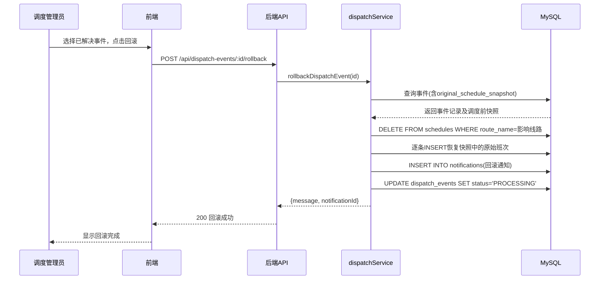
```mermaid
sequenceDiagram
    participant U as 调度管理员
    participant F as 前端
    participant A as 后端API
    participant DS as dispatchService
    participant DB as MySQL

    U->>F: 选择已解决事件，点击回滚
    F->>A: POST /api/dispatch-events/:id/rollback
    A->>DS: rollbackDispatchEvent(id)
    DS->>DB: 查询事件(含original_schedule_snapshot)
    DB-->>DS: 返回事件记录及调度前快照
    DS->>DB: DELETE FROM schedules WHERE route_name=影响线路
    DS->>DB: 逐条INSERT恢复快照中的原始班次
    DS->>DB: INSERT INTO notifications(回滚通知)
    DS->>DB: UPDATE dispatch_events SET status='PROCESSING'
    DS-->>A: {message, notificationId}
    A-->>F: 200 回滚成功
    F-->>U: 显示回滚完成
```

### 7.5 师生实时查询时序图

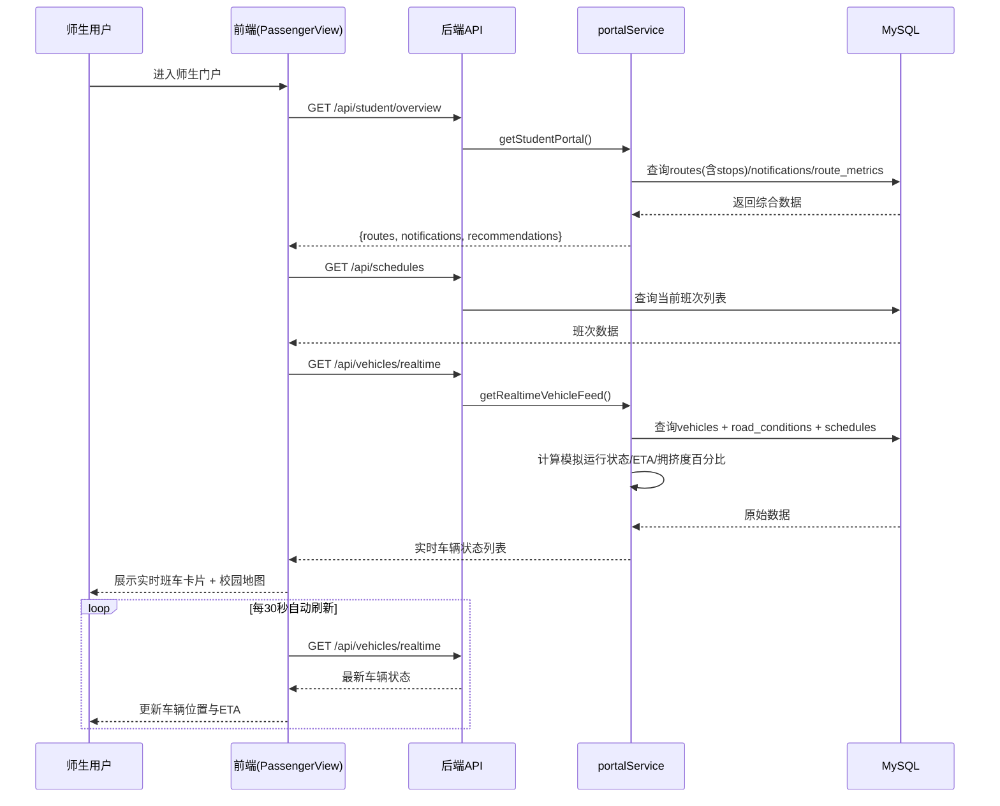
```mermaid
sequenceDiagram
    participant U as 师生用户
    participant F as 前端(PassengerView)
    participant A as 后端API
    participant PS as portalService
    participant DB as MySQL

    U->>F: 进入师生门户
    F->>A: GET /api/student/overview
    A->>PS: getStudentPortal()
    PS->>DB: 查询routes(含stops)/notifications/route_metrics
    DB-->>PS: 返回综合数据
    PS-->>F: {routes, notifications, recommendations}

    F->>A: GET /api/schedules
    A->>DB: 查询当前班次列表
    DB-->>F: 班次数据

    F->>A: GET /api/vehicles/realtime
    A->>PS: getRealtimeVehicleFeed()
    PS->>DB: 查询vehicles + road_conditions + schedules
    PS->>PS: 计算模拟运行状态/ETA/拥挤度百分比
    DB-->>PS: 原始数据
    PS-->>F: 实时车辆状态列表
    F-->>U: 展示实时班车卡片 + 校园地图

    loop 每30秒自动刷新
        F->>A: GET /api/vehicles/realtime
        A-->>F: 最新车辆状态
        F-->>U: 更新车辆位置与ETA
    end
```

### 7.6 班次版本管理时序图

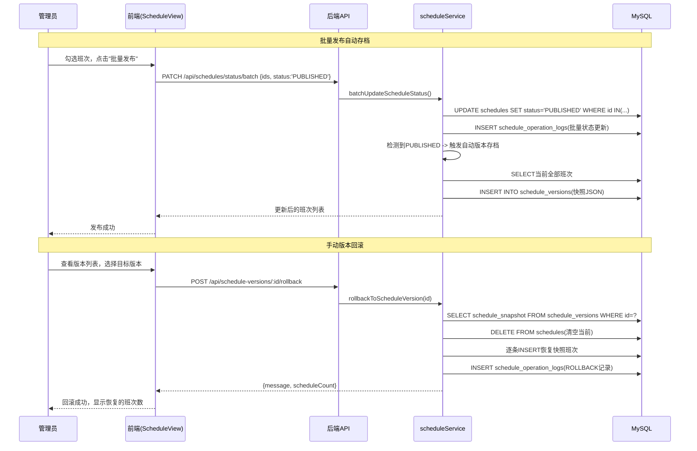
```mermaid
sequenceDiagram
    participant U as 管理员
    participant F as 前端(ScheduleView)
    participant A as 后端API
    participant SS as scheduleService
    participant DB as MySQL

    Note over U,DB: 批量发布自动存档
    U->>F: 勾选班次，点击"批量发布"
    F->>A: PATCH /api/schedules/status/batch {ids, status:'PUBLISHED'}
    A->>SS: batchUpdateScheduleStatus()
    SS->>DB: UPDATE schedules SET status='PUBLISHED' WHERE id IN(...)
    SS->>DB: INSERT schedule_operation_logs(批量状态更新)
    SS->>SS: 检测到PUBLISHED -> 触发自动版本存档
    SS->>DB: SELECT当前全部班次
    SS->>DB: INSERT INTO schedule_versions(快照JSON)
    SS-->>F: 更新后的班次列表
    F-->>U: 发布成功

    Note over U,DB: 手动版本回滚
    U->>F: 查看版本列表，选择目标版本
    F->>A: POST /api/schedule-versions/:id/rollback
    A->>SS: rollbackToScheduleVersion(id)
    SS->>DB: SELECT schedule_snapshot FROM schedule_versions WHERE id=?
    SS->>DB: DELETE FROM schedules(清空当前)
    SS->>DB: 逐条INSERT恢复快照班次
    SS->>DB: INSERT schedule_operation_logs(ROLLBACK记录)
    SS-->>F: {message, scheduleCount}
    F-->>U: 回滚成功，显示恢复的班次数
```

### 7.7 统计分析查询时序图

```mermaid
sequenceDiagram
    participant U as 管理员
    participant F as 前端(AnalyticsView)
    participant A as 后端API
    participant DB as MySQL

    U->>F: 进入统计分析页面
    F->>A: GET /api/analytics
    A->>DB: 查询route_metrics(线路热度)
    A->>DB: 查询schedules(满载率分布)
    A->>DB: 查询dispatch_events(事件等级统计)
    A->>DB: 计算空驶率(满载率<35%的班次占比)
    A->>DB: 计算排班适配准确率(已覆盖需求时段/总需求时段)
    A->>A: 生成人工基线对比(固定30分钟间隔方案)
    DB-->>A: 各维度统计数据
    A-->>F: {routeMetrics, occupancy, eventsBySeverity, emptyRunStats, scheduleAccuracy, baselineComparison}
    F-->>U: 展示图表: 线路热度/满载率分布/事件饼图/空驶率柱图/准确率/基线对比表
```
